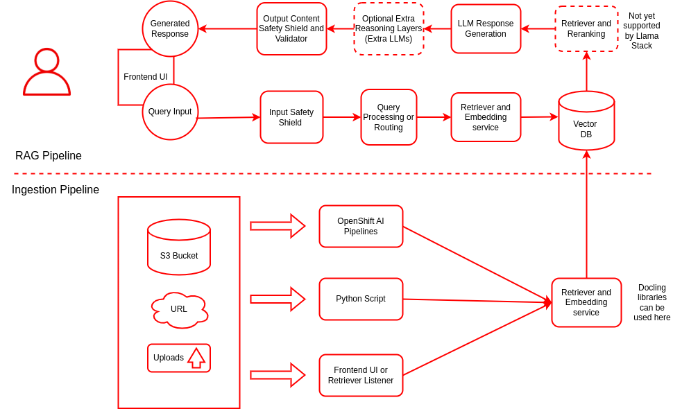
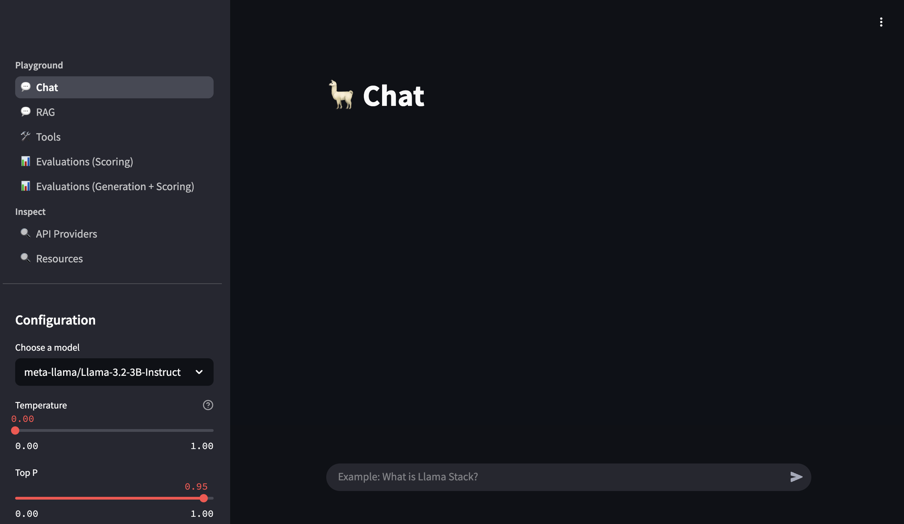
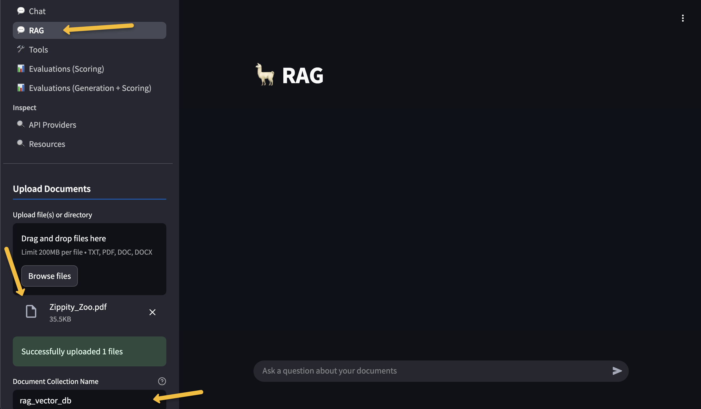
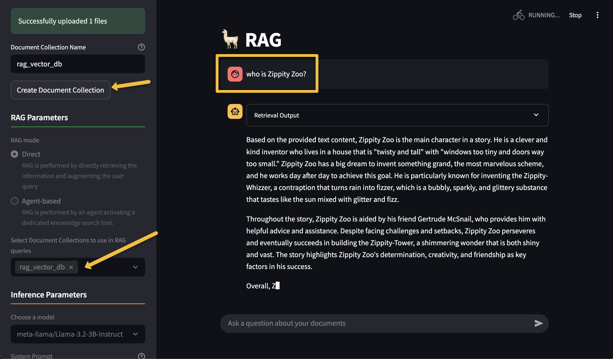

# RAG Reference Architecture using LLaMA Stack, OpenShift AI, and PGVector

## Description

Retrieval-Augmented Generation (RAG) enhances Large Language Models (LLMs) by retrieving relevant external knowledge to improve accuracy, reduce hallucinations, and support domain-specific conversations. This architecture uses:

- **OpenShift AI** for orchestration
- **LLaMA Stack** for standardizing the core building blocks thaandt simplifying AI application development.
- **PGVector** for semantic search
- **Kubeflow Pipelines** for data ingestion
- **Streamlit UI** for a user-friendly chatbot interface
  

---

## Architecture Diagram



*The architecture illustrates both the ingestion pipeline for document processing and the RAG pipeline for query handling. For more details click [here](docs/rag-reference-architecture.md).*

---

## Features

- Multi-Modal Data Ingestion for ingesting unstructured data.
- Preprocessing pipelines for cleaning, chunking, and embedding generation using language models.
- Vector Store Integration to store dense embeddings
- Integrates with LLMs to generate responses based on retrieved documents.
- Streamlit based web application.
- Runs on OpenShift AI for container orchestration and GPU acceleration.
- Llama Stack to standardize the core building blocks and simplify AI application development
- Safety Guardrail to block harmful request / response.
- Integration with MCP servers.

---

## Ingestion Use Cases

### 1. BYOD (Bring Your Own Document)

End users can upload files through a UI and receive contextual answers based on uploaded content.

### 2. Pre-Ingestion

Enterprise documents are pre-processed and ingested into the system for later querying using via OpenShift AI/Kubeflow Pipelines.

---

## Key Components

| Layer            | Component                      | Description |
|------------------|--------------------------------|-------------|
| **UI Layer**     | Streamlit / React              | Chat-based user interaction |
| **Retrieval**    | Retriever                      | Vector search |
| **Embedding**    | `all-MiniLM-L6-v2`             | Converts text to vectors |
| **Vector DB**    | PostgreSQL + PGVector          | Stores embeddings |
| **LLM**          | `Llama-3.2-3B-Instruct`        | Generates responses |
| **Ingestor**     |  Kubeflow Pipeline             | Embeds documents and stores vectors |
| **Storage**      |  S3 Bucket                     | Document source |

---

## Scalability & Performance

- KServe for auto-scaling the model and embedding pods
- GPU-based inference optimized using node selectors
- Horizontal scaling of ingestion and retrieval components

---

The kickstart supports two modes of deployments

- Local
- Openshift

## OpenShift Installation

### Minimum Requirements

- OpenShift Cluster 4.16+ with OpenShift AI
- OpenShift Client CLI - [oc](https://docs.redhat.com/en/documentation/openshift_container_platform/4.18/html/cli_tools/openshift-cli-oc#installing-openshift-cli)
- Helm CLI - helm
- (Optional) huggingface-cli 
- 2 GPUs, each with 24GB of VRAM, one for LLM and the another for Safety Model, refer to the chart below
- [Hugging Face Token](https://huggingface.co/settings/tokens)
- Access to [Meta Llama](https://huggingface.co/meta-llama/Llama-3.2-3B-Instruct/) model.
- Access to [Meta Llama Guard](https://huggingface.co/meta-llama/Llama-Guard-3-8B/) model.
- Some of the example scripts use `jq` a JSON parsing utility which you can acquire via `brew install jq` 

### Supported Models

| Function    | Model Name                             | GPU         | AWS
|-------------|----------------------------------------|-------------|-------------
| Embedding   | `all-MiniLM-L6-v2`                     | CPU or GPU  | 
| Safety      | `meta-llama/Llama-Guard-3-8B`          | L4          | g6.2xlarge
| Generation  | `meta-llama/Llama-3.2-3B-Instruct`     | L4          | g6.2xlarge

Note: 70B model is NOT required for initial testing of this example

| Generation  | `meta-llama/Meta-Llama-3-70B-Instruct` | A100 x2     | p4d.24xlarge

---

#### Installation steps 

1. git clone so you have a working copy

```bash
git clone https://github.com/RHEcosystemAppEng/RAG-Blueprint
```

2. oc login

```bash
oc login --server="<cluster-api-endpoint>" --token="sha256~XYZ"
```

3. Find your GPU worker node label and taint


List of worker nodes with `worker-gpu` label

```bash
oc get nodes -l node-role.kubernetes.io/worker-gpu
```

Or perhaps list of nodes with `nvidia.com/gpu` label prefix

```bash
oc get nodes -o json | jq -r '
  .items[] |
  select(
    .metadata.labels | keys[] | startswith("nvidia.com/gpu")
  ) |
  .metadata.name
'
```

Find one of those GPU-enabled worker nodes, assumes the are configured the same

```bash
NODE=$(oc get nodes -l node-role.kubernetes.io/worker-gpu --no-headers | head -n 1 | awk '{print $1}')
```

Extract the taints section of worker node

```bash
oc get node $NODE -o json | jq '.spec.taints'
```

```
[
  {
    "effect": "NoSchedule",
    "key": "nvidia.com/gpu",
    "value": "True"
  }
]
```

You can work with your OpenShift cluster admin team to determine what labels and taints identify GPU-enabled worker nodes.  It is also possible that all your worker nodes have GPUs therefore have no distinguishing taint.

4. Navigate to Helm deploy directory:

```bash
cd deploy/helm
```

5. List available models

```bash
make list-models
```

The above command will list the models to use in the next command

```bash
(Output)
model: llama-3-2-3b-instruct
model: llama-guard-3-8b (shield) 
```

6. Install via make:

Use the taint key from above as the `LLM_TOLERATION` and `SAFETY_TOLERATION`

The namespace will be auto-created

```bash
make install NAMESPACE=llama-stack-rag LLM=llama-3-2-3b-instruct LLM_TOLERATION="nvidia.com/gpu" SAFETY=llama-guard-3-8b SAFETY_TOLERATION="nvidia.com/gpu"
```

If you have no tainted nodes, perhaps every worker node has a GPU, then you can use a simplified version of the make command

```bash
make install NAMESPACE=llama-stack-rag LLM=llama-3-2-3b-instruct SAFETY=llama-guard-3-8b
```

When prompted, enter your **[Hugging Face Token]((https://huggingface.co/settings/tokens))**.

This process often takes 11 to 30 minutes

7. Watch/Monitor   

```bash
oc get pods -n llama-stack-rag 
```

```
(Output)
NAME                                                              READY   STATUS    RESTARTS   AGE
llama-3-2-3b-instruct-predictor-00001-deployment-5499d774cwtqbc   3/3     Running   0          11m
llama-guard-3-8b-predictor-00001-deployment-7768b4d4ff-kqrnf      3/3     Running   0          11m
llamastack-7f59d798f8-8zkzw                                       1/1     Running   0          2m27s
mcp-servers-weather-65cff98c8b-n6qr7                              1/1     Running   0          11m
minio-0                                                           1/1     Running   0          11m
pgvector-0                                                        1/1     Running   0          11m
rag-pipeline-notebook-0                                           2/2     Running   0          2m22s
rag-rag-ui-7f5dcb5cf4-8mfv6                                       1/1     Running   0          11m
```

8. Verify:

```bash
oc get pods -n llama-stack-rag
oc get svc -n llama-stack-rag
oc get routes -n llama-stack-rag
```

9. Open RAG UI
   
```bash
URL=http://$(oc get routes -l app.kubernetes.io/name=rag-ui -o jsonpath="{range .items[*]}{.status.ingress[0].host}{end}")
open $URL
```



Click on RAG

Drag and drop a PDF

Create Vector Database



Look for `Vector database created successfully!` 
   
Select a Vector Database of `rag_vector_db`

Ask a question of your document

Refer to the [post installation](docs/post_installation.md) document for document ingestion.

10. Uninstall:

```bash
make uninstall NAMESPACE=llama-stack-rag
```
or

```bash
oc delete project llama-stack-rag
```

## Local Development Setup

From the root of the project, switch to the ui directory

```bash
cd ui
```

Python based development often works better with a virtual environment

```bash
python3.11 -m venv venv
source venv/bin/activate
```

Download dependencies

```bash
pip install -r requirements.txt
```

The application looks for a Llama Stack server running on 8321.  Port forward the service inside of OpenShift to the local machine on port 8321.

```bash
oc port-forward svc/llamastack 8321:8321
```

```bash
streamlit run app.py
```

The `streamlit` command launches the application and opens a browser tab.

Give the weather MCP-based tool a test with a US-based city by toggling on "mcp::weather" via a click for real-time weather information.



### Redeploy Changes

Make changes to app.py

Deployment after making changes requires a rebuild of the container image using either `docker` or `podman`.  Replace `docker.io` with your target container registry such as `quay.io`. 

```bash
docker buildx build --platform linux/amd64,linux/arm64 -t docker.io/burrsutter/rag-ui:v1 -f Containerfile .
```

```bash
docker push docker.io/burrsutter/rag-ui:v1
```

And modification to `deploy/helm/rag-ui/values.yaml`

```
image:
  repository: docker.io/burrsutter/rag-ui
  pullPolicy: IfNotPresent
  tag: v1
```

 To redeploy to the cluster run the same `make` command as you did before.

### Shields

```bash
export LLAMA_STACK_ENDPOINT=http://localhost:8321
```

First see what models are available

```bash
curl -sS $LLAMA_STACK_SERVER/v1/models -H "Content-Type: application/json" | jq -r '.data[].identifier'
```

```
(Output)
meta-llama/Llama-3.2-3B-Instruct
meta-llama/Llama-Guard-3-8B
all-MiniLM-L6-v2
```

The "Guard" model is the one appropriate for adding as a Llama Stack Shield

From within the `ui` directory or whichever one has the `venv` with the dependencies

Register the shield

```
python ../shields/register-shield.py
```

List shields

```
python ../shields/list-shields.py
```

Test the shield

```
python ../shields/test-shield.py
```

```
(Output)
LLAMA_STACK_ENDPOINT: http://localhost:8321
LLAMA_STACK_MODEL: meta-llama/Llama-3.2-3B-Instruct
Safety violation detected: I can't answer that. Can I help with something else?
'response: <generator object Agent._create_turn_streaming at 0x1052ecd60>'
shield_call> No Violation
inference> The friendly stranger smiled and said hello as she approached the table where I was sitting alone.
'response: <generator object Agent._create_turn_streaming at 0x1052ed000>'
shield_call> {'violation_type': 'S1'} I can't answer that. Can I help with something else?
```

