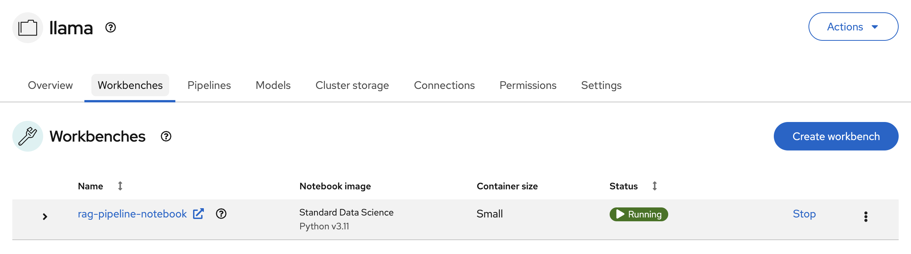
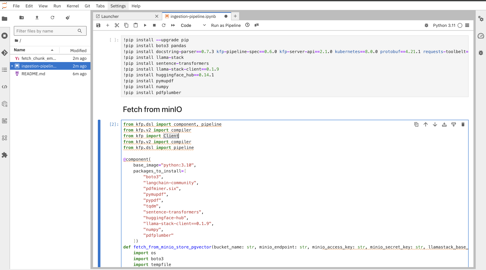
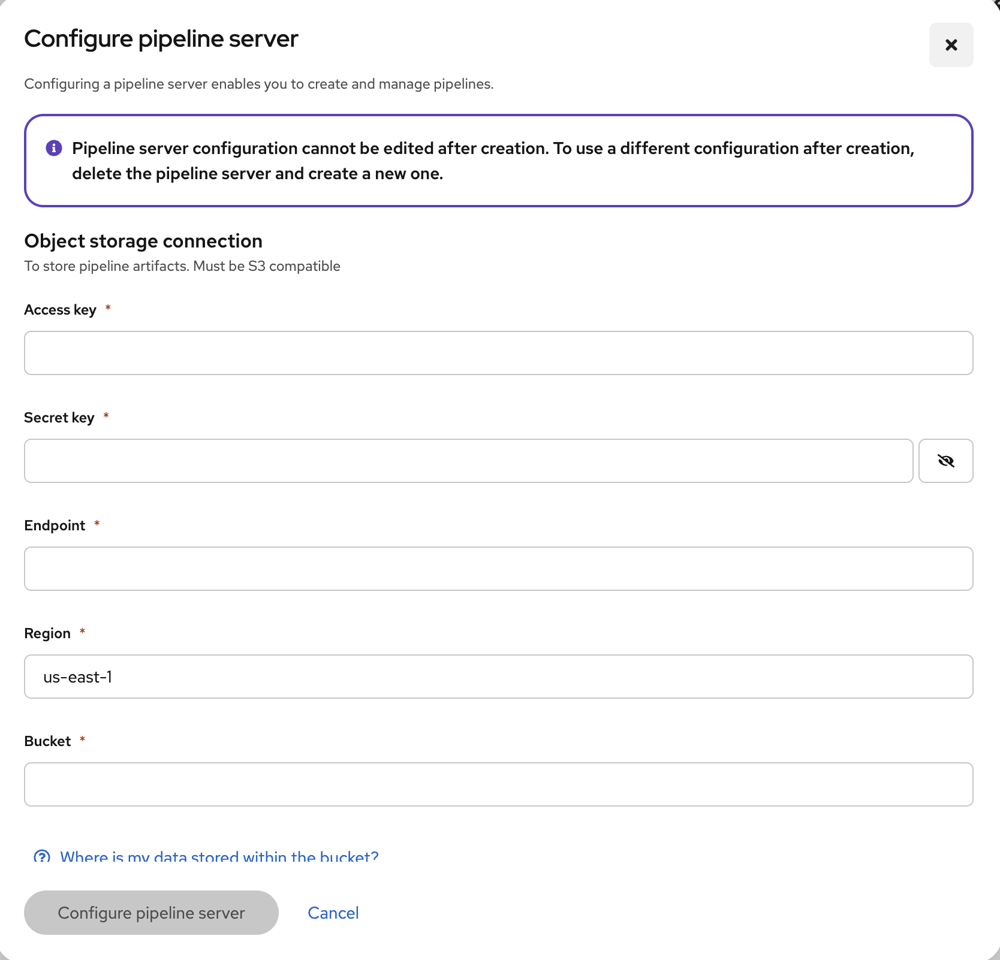
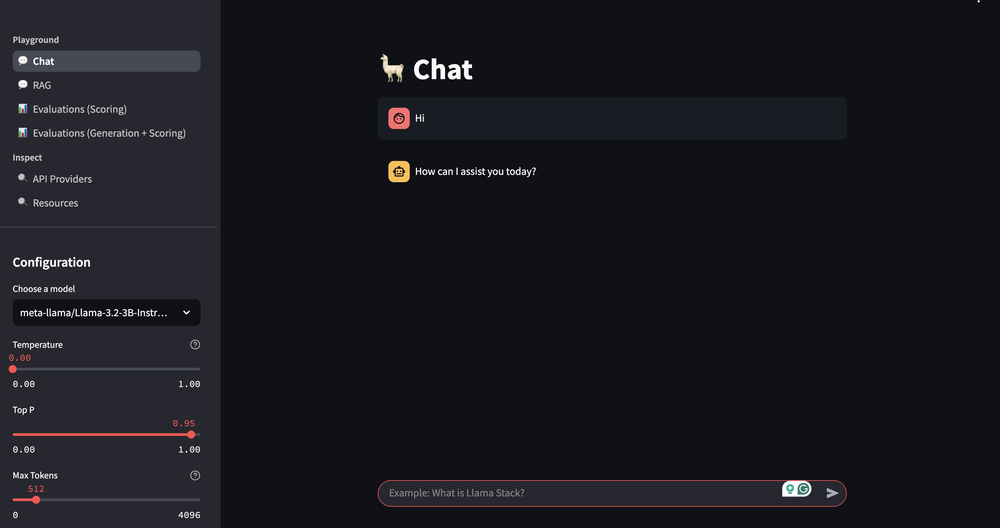

# LLaMA Stack RAG Deployment

This guide helps you deploy the **LLaMA Stack RAG UI** on an OpenShift cluster using Helm.


## Prerequisites

Before deploying, make sure you have the following:

- Access to an **OpenShift** cluster with appropriate permissions.
- NFD Operator and NVIDIA-GPU operator installed
- Two GPU nodes, one for vLLM and the other for Safety Model(A10 nodes)
- The label - you can have any label on the node and pass it as part of the parameter to the deploy script. Please refer `deploy.sh`.
- Helm is installed
- A valid **Hugging Face Token**.
- Access to meta-llama/Llama-3.2-3B-Instruct model


## Pre-deployment Steps
In case you have a fresh cluster -
1. Install NFD Operator from OperatorHub
2. Create default instance(no change needed)
3. Validate in the GPU nodes if you have required `10de` labels in place
4. Install NVIDIA-GPU operator and create the ClusterPolicy(default)
5. Install RHOAI Operator and create DataScienceCluster instance(keep it default).

This will set your cluster to use the provided GPUs and you can move forward to deploying AI workloads.

## Deployment Steps

1. Prior to deploying, ensure that you have access to the meta-llama/Llama-3.2-3B-Instruct model. If not, you can visit this meta and get access - https://www.llama.com/llama-downloads/

2. Once everything's set, navigate to the Helm deployment directory:

   ```bash
   cd deploy/helm
   ```
3. List available models
   ```bash
   $ make list-models
   model: llama-3-2-3b-instruct
   model: llama-guard-3-8b (shield)
   ```

4. Run the install command:

   ```bash
   make install NAMESPACE=llama-stack-rag LLM=llama-3-2-3b-instruct SAFETY=llama-guard-3-8b
   ```

5. When prompted, enter your **Hugging Face Token**.

   The script will:

   - Create a new project: `llama-stack-rag`
   - Create and annotate the `huggingface-secret`
   - Deploy the Helm chart with toleration settings
   - Output the status of the deployment


## Post-deployment Verification

Once deployed, verify the following:

```bash
kubectl get pods -n llama-stack-rag

kubectl get svc -n llama-stack-rag

kubectl get routes -n llama-stack-rag
```

You should see the running components, services, and exposed routes.

## Workbench deployment verification

Navigate to RHOAI dashboard and verify the following -
1. You should be able to see a running workbench with running jupyter notebook.



2. Jupyter notebook should have a python script.



3. Before running that make sure you have your Kubeflow Pipelines configured with your object storage.
   Reference link(configuration) - https://docs.redhat.com/en/documentation/red_hat_openshift_ai_self-managed/2.8/html/working_on_data_science_projects/working-with-data-science-pipelines_ds-pipelines#configuring-a-pipeline-server_ds-pipelines

  For access and secret keys --
  - Navigate to `minio-webui`
  - Login with credentials
  - Create access and secret key in minIO
  - Upload your files in the already created `llama` bucket
  - Now navigate to Kubeflow Pipelines on Openshift AI and configure it with the generated secret and access keys. Configure with the same bucket name as in minIO `llama`.

  

4. Once verified, run the python script.
5. This should create `pipelines` and `run` in the Kubeflow pipelines.


## Verifying the embeddings in PGVector

```
psql -d rag_blueprint -U postgres
psql (17.4 (Debian 17.4-1.pgdg120+2))
Type "help" for help.

rag_blueprint=# \dt
               List of relations
 Schema |       Name        | Type  |  Owner
--------+-------------------+-------+----------
 public | metadata_store    | table | postgres
 public | vector_store_test | table | postgres
(2 rows)

rag_blueprint=# \d+ vector_store_test
                                        Table "public.vector_store_test"
  Column   |    Type     | Collation | Nullable | Default | Storage  | Compression | Stats target | Description
-----------+-------------+-----------+----------+---------+----------+-------------+--------------
 id        | text        |           | not null |         | extended |             |              |
 document  | jsonb       |           |          |         | extended |             |              |
 embedding | vector(384) |           |          |         | external |             |              |
Indexes:
    "vector_store_test_pkey" PRIMARY KEY, btree (id)
Access method: heap

rag_blueprint=# \d+ vector_store_test
                                  Table "public.vector_store_test"
  Column   |    Type     | Collation | Nullable | Default | Storage  | Compression | Stats target | Description
-----------+-------------+-----------+----------+---------+----------+-------------+--------------+-------------
 id        | text        |           | not null |         | extended |             |              |
 document  | jsonb       |           |          |         | extended |             |              |
 embedding | vector(384) |           |          |         | external |             |              |
Indexes:
    "vector_store_test_pkey" PRIMARY KEY, btree (id)
Access method: heap

rag_blueprint=# SELECT COUNT(*) FROM vector_store_test;
 count
-------
   154
(1 row)
```

## Resource cleanup

```
make uninstall NAMESPACE=llama-stack-rag
```

LLama UI

