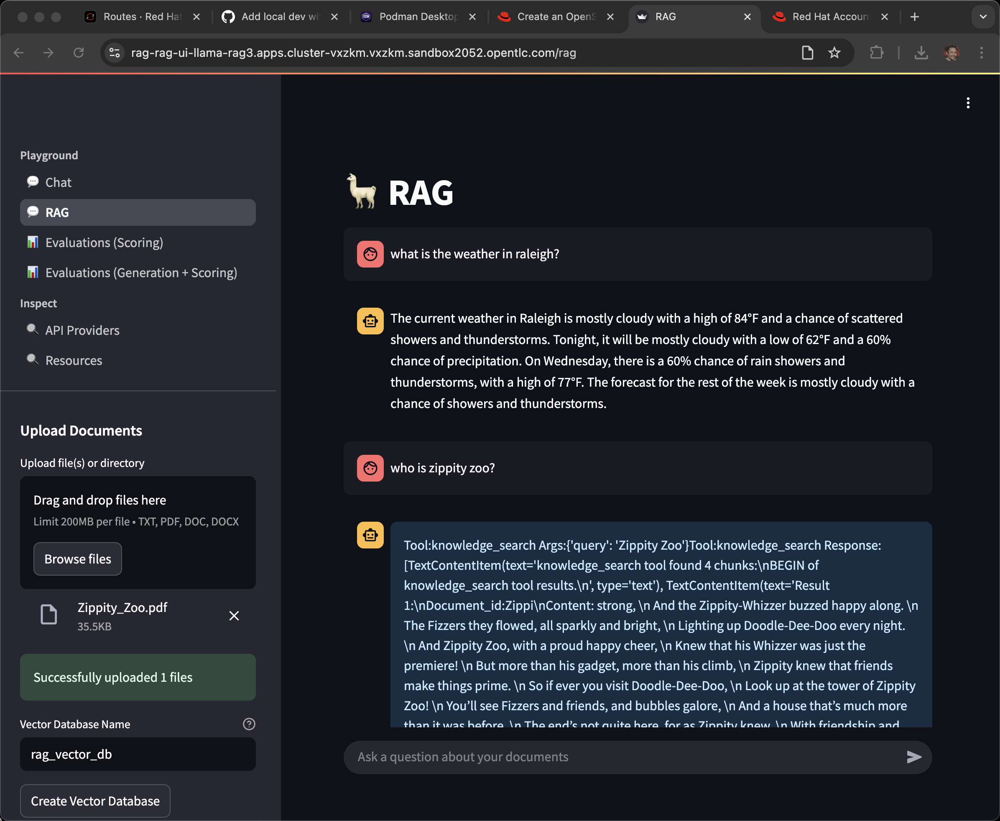

# RAG Reference Architecture using LLaMA Stack, OpenShift AI, and PGVector

## Overview

Retrieval-Augmented Generation (RAG) enhances Large Language Models (LLMs) by retrieving relevant external knowledge to improve accuracy, reduce hallucinations, and support domain-specific conversations. This architecture uses:

- **OpenShift AI** for orchestration
- **LLaMA Stack** for standardizing the core building blocks thaandt simplifying AI application development.
- **PGVector** for semantic search
- **Kubeflow Pipelines** for data ingestion
- **Streamlit / React UI** for a user-friendly chatbot interface
  
---

## Architecture Diagram


*The architecture illustrates both the ingestion pipeline for document processing and the RAG pipeline for query handling. For more details click [here](docs/rag-reference-architecture.md).*

---

## Features

- Multi-Modal Data Ingestion for ingesting unstructured data.
- Preprocessing pipelines for cleaning, chunking, and embedding generation using language models.
- Vector Store Integration to store dense embeddings
- Integrates with LLMs to generate responses based on retrieved documents.
- Streamlit based web application.
- Runs on OpenShift AI for container orchestration and GPU acceleration.
- Llama Stack to standardize the core building blocks and simplify AI application development
- Safety Guardrail to block harmful request / response.
- Integration with MCP servers.

---

## Ingestion Use Cases

### 1. BYOD (Bring Your Own Document)

End users can upload files through a UI and receive contextual answers based on uploaded content.

### 2. Pre-Ingestion

Enterprise documents are pre-processed and ingested into the system for later querying using via OpenShift AI/Kubeflow Pipelines.

---

## Key Components

| Layer            | Component                      | Description |
|------------------|--------------------------------|-------------|
| **UI Layer**     | Streamlit / React              | Chat-based user interaction |
| **Retrieval**    | Retriever                      | Vector search |
| **Embedding**    | `all-MiniLM-L6-v2`             | Converts text to vectors |
| **Vector DB**    | PostgreSQL + PGVector          | Stores embeddings |
| **LLM**          | `Llama-3.2-3B-Instruct`        | Generates responses |
| **Ingestor**     |  Kubeflow Pipeline             | Embeds documents and stores vectors |
| **Storage**      |  S3 Bucket                     | Document source |

---

## Scalability & Performance

- KServe for auto-scaling the model and embedding pods
- GPU-based inference optimized using node selectors
- Horizontal scaling of ingestion and retrieval components

---

The Bluprint supports two modes of deployments

- Local
- Openshift

## OpenShift Deployment

### Minimum Requirements

- OpenShift Cluster 4.16+ with OpenShift AI
- 2+ GPUs one for LLM and the another for Safety Model (A10 nodes), refer to the chart below
- [Hugging Face Token](https://huggingface.co/settings/tokens)
- Access to [Meta Llama](https://huggingface.co/meta-llama/Llama-3.2-3B-Instruct/tree/main) models.

### Supported Models

| Function       | Model Name                                | GPU                  |
|----------------|-------------------------------------------|----------------------|
| Embedding      | `all-MiniLM-L6-v2`                        | A10 (Optional)       |
| Safety         | `meta-llama/Llama-Guard-3-8B`             | A10                  |
| Generation     | `meta-llama/Llama-3.2-3B-Instruct`        | A10                  |
|                | `meta-llama/Meta-Llama-3-70B-Instruct`    | NVIDIA A100 80GB x2  |

---

1. Navigate to Helm deploy directory:

   ```bash
   cd deploy/helm
   ```

2. List available models

   ```bash
   make list-models
   ```

   The above command will list the models to use in the next command

   ```bash
   (Output)
   model: llama-3-2-3b-instruct
   model: llama-guard-3-8b (shield) 
   ```

3. Install:

    ```bash
   make install NAMESPACE=llama-stack-rag LLM=llama-3-2-3b-instruct SAFETY=llama-guard-3-8b
   ```

   If you have tainted the nodes, you can specify

   ```bash
   make install NAMESPACE=llama-stack-rag LLM=llama-3-2-3b-instruct LLM_TOLERATION="nvidia.comg/gpu" SAFETY=llama-guard-3-8b SAFETY_TOLERATION="nvidia.comg/gpu"
   ```

   When prompted, enter your **[Hugging Face Token]((https://huggingface.co/settings/tokens))**.

4. Verify:

   ```bash
   kubectl get pods -n rag-app
   kubectl get svc -n rag-app
   kubectl get routes -n rag-app
   ```

   **TODO: Add the instructions to display the URL to launch app**

   Refer to the [post installation](docs/post_installation.md) document for document ingestion.

5. Uninstall:

   ```bash
   make uninstall NAMESPACE=rag-app
   ```

## Local Deployment

WIP

LLama UI
