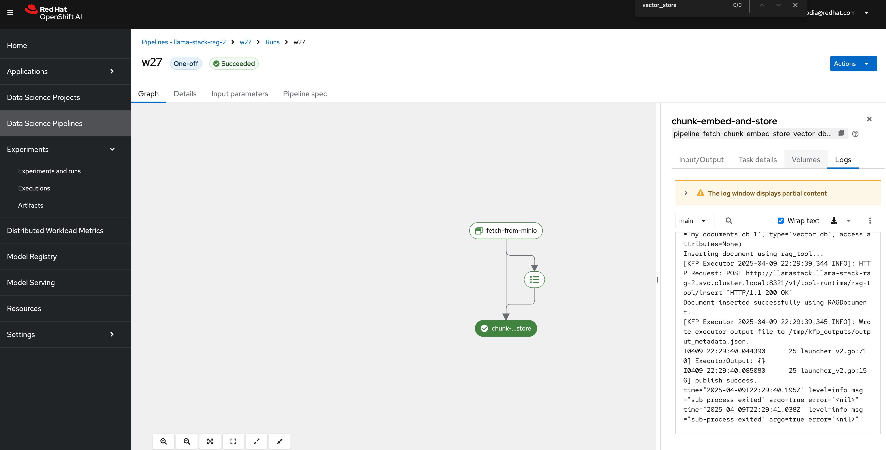
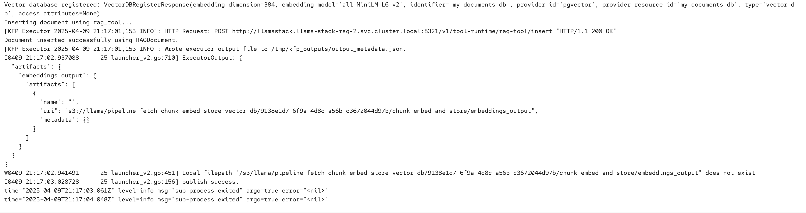
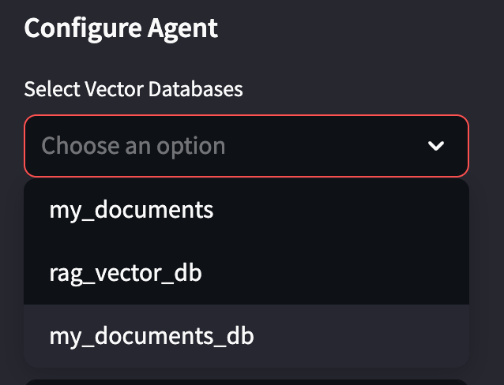

# Kubeflow Pipeline for PDF Processing and Vector Storage using LLaMA Stack Client

This repository provides a Kubeflow pipeline that automates the process of fetching **PDF documents from MinIO**, extracting and chunking content, generating embeddings and storing them in a **PGVector** using the `llama_stack_client` and `RAGDocument`.

---

## Overview

The pipeline includes:
1. **Fetching Data from MinIO**: Retrieves a PDF file from an S3-compatible MinIO bucket.
2. **Processing and Storing via LLaMA Stack**: Uses `RAGDocument` and `rag_tool.insert` to extract, chunk, embed, and store data in PGVector.

---

## Requirements

- Installed openshift cluster
- Installed openshift ai
- Installed llama-stack
- Installed minIO with access and secret keys
- Workbench(Jupyter notebook)
- KubeFlow Pipelines configured with minIO access and secret keys

---

## Components

### 1. `fetch_from_minio`

Downloads the file from MinIO using supplied credentials and endpoint.

**Inputs:**

- `bucket_name`
- `file_key`
- `minio_endpoint`
- `minio_access_key`
- `minio_secret_key`

**Outputs:**

- `output_file`: Local file path of the fetched PDF.


### 2. `chunk_embed_and_store`

Reads and processes the fetched PDF using `pdfplumber`, creates a `RAGDocument`, and stores it into PGVector using the `LLaMA Stack RAG Tool`.

#### Highlights:

- Extracts and cleans PDF text
- Generates a **unique document ID**
- Creates a RAGDocument

```
document = RAGDocument(
        document_id=f"pdf-{random_id}-1",
        content=full_text,
        mime_type="application/pdf",
        metadata={"source": "rag-pipeline", "filename": os.path.basename(input_file)},
    )
```

- Embeds and Stores into PGVector

```
client = LlamaStackClient(base_url="http://llamastack.llama-stack-rag-2.svc.cluster.local:8321")

    response = client.vector_dbs.register(
        vector_db_id="my_documents_db",
        embedding_model="all-MiniLM-L6-v2",
        embedding_dimension=384,
        provider_id="pgvector",
    )
    print(f"Vector database registered: {response}")
    
    print("Inserting document using rag_tool...")
    client.tool_runtime.rag_tool.insert(
        documents=[document],
        vector_db_id="my_documents_db",
        chunk_size_in_tokens=512,
    )
    print("Document inserted successfully using RAGDocument.")
```


---

## Pipeline Flow

1. **Fetch PDF** from MinIO  
2. **Extract + Clean** content  
3. **Embed + Store** using `rag_tool.insert`

---

## Example Kubeflow Pipeline

```python
@pipeline(name="rag-pipeline-pdf-ingestion")
def rag_ingestion_pipeline():
    fetched = fetch_from_minio(
        bucket_name="llama",
        file_key="papers/sample.pdf",
        minio_endpoint="<minio-api-url>",
        minio_access_key="<username>>",
        minio_secret_key="<password>"
    )

    chunk_embed_and_store(
        input_file=fetched.outputs["output_file"],
    )
```

---

## How to Run

### 1. Compile the pipeline

```bash
compiler.Compiler().compile(
    pipeline_func=rag_ingestion_pipeline,
    package_path="rag_pipeline.yaml"
)
```

### 2. Run via Kubeflow UI

Upload and trigger `rag_pipeline.yaml`.



Output -

KFP logs 



PGVector Logs 


You can see the registered database has been available now on RAG UI


---

## Environment Variables

Make sure to configure:

- `MINIO_ENDPOINT`
- `MINIO_ACCESS_KEY`
- `MINIO_SECRET_KEY`
- LlamaStack url

---

## Inspecting PGVector

To inspect stored documents:

```sql
$ psql -d rag_blueprint -U postgres
psql (17.4 (Debian 17.4-1.pgdg120+2))
Type "help" for help.

rag_blueprint=# \l
                                                      List of databases
     Name      |  Owner   | Encoding | Locale Provider |  Collate   |   Ctype    | Locale | ICU Rules |   Access privileges   
---------------+----------+----------+-----------------+------------+------------+--------+-----------+-----------------------
 postgres      | postgres | UTF8     | libc            | en_US.utf8 | en_US.utf8 |        |           | 
 rag_blueprint | postgres | UTF8     | libc            | en_US.utf8 | en_US.utf8 |        |           | 
 template0     | postgres | UTF8     | libc            | en_US.utf8 | en_US.utf8 |        |           | =c/postgres          +
               |          |          |                 |            |            |        |           | postgres=CTc/postgres
 template1     | postgres | UTF8     | libc            | en_US.utf8 | en_US.utf8 |        |           | =c/postgres          +
               |          |          |                 |            |            |        |           | postgres=CTc/postgres
(4 rows)

rag_blueprint=# \dt
                     List of relations
 Schema |              Name              | Type  |  Owner   
--------+--------------------------------+-------+----------
 public | embeddings                     | table | postgres
 public | metadata_store                 | table | postgres
 public | vector_store_my_documents      | table | postgres
 public | vector_store_my_documents_db   | table | postgres
 public | vector_store_my_documents_db_1 | table | postgres
 public | vector_store_rag_vector_db     | table | postgres
(6 rows)

rag_blueprint=# \d+ vector_store_my_documents_db
                                  Table "public.vector_store_my_documents_db"
  Column   |    Type     | Collation | Nullable | Default | Storage  | Compression | Stats target | Description 
-----------+-------------+-----------+----------+---------+----------+-------------+--------------+-------------
 id        | text        |           | not null |         | extended |             |              | 
 document  | jsonb       |           |          |         | extended |             |              | 
 embedding | vector(384) |           |          |         | external |             |              | 
Indexes:
    "vector_store_my_documents_db_pkey" PRIMARY KEY, btree (id)
Access method: heap

rag_blueprint=# \d+ vector_rag_vector_db
Did not find any relation named "vector_rag_vector_db".
rag_blueprint=# \d+ vector_store_rag_vector_db
                                   Table "public.vector_store_rag_vector_db"
  Column   |    Type     | Collation | Nullable | Default | Storage  | Compression | Stats target | Description 
-----------+-------------+-----------+----------+---------+----------+-------------+--------------+-------------
 id        | text        |           | not null |         | extended |             |              | 
 document  | jsonb       |           |          |         | extended |             |              | 
 embedding | vector(384) |           |          |         | external |             |              | 
Indexes:
    "vector_store_rag_vector_db_pkey" PRIMARY KEY, btree (id)
Access method: heap

rag_blueprint=# SELECT COUNT(*) FROM vector_store_my_documents_db_1;
 count 
-------
   154
(1 row)

rag_blueprint=# SELECT COUNT(*) FROM vector_store_my_documents_db;
 count 
-------
   764
(1 row)

```

---

## License

This project is licensed under the **MIT License**