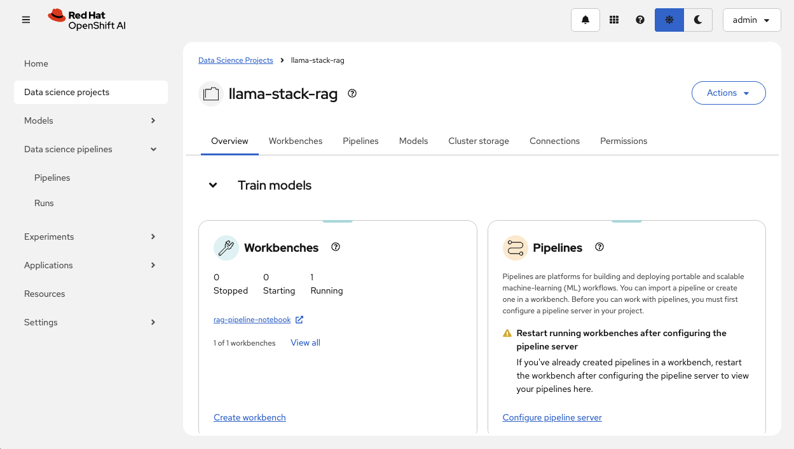
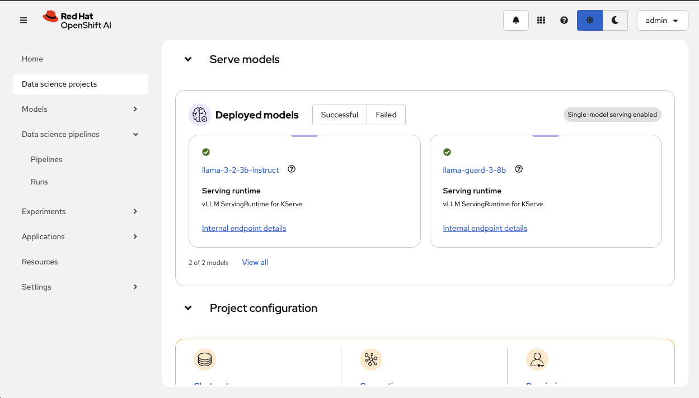
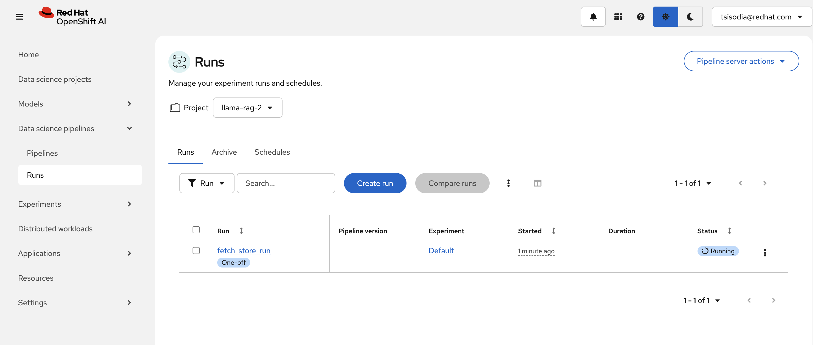
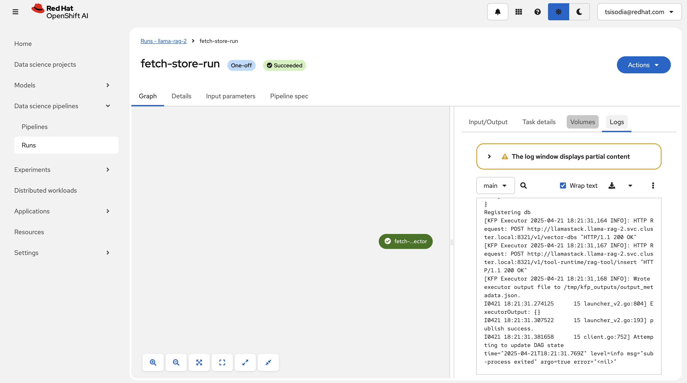

## Workbench deployment verification

Navigate to OpenShift AI Dashboard and verify the following -

1. Login to the OpenShift AI Dashboard and find the `llama-stack-rag` project.  You can find the route via:

```bash
oc get routes rhods-dashboard -n redhat-ods-applications
```





2. You should be able to see a running workbench with running Jupyter Notebook.


3. Jupyter notebook should have a python script.


4. Before running that make sure you have your Kubeflow Pipelines configured with your object storage.
   [Reference](https://docs.redhat.com/en/documentation/red_hat_openshift_ai_self-managed/2.8/html/working_on_data_science_projects/working-with-data-science-pipelines_ds-pipelines#configuring-a-pipeline-server_ds-pipelines)

  For access and secret keys --
  - Navigate to `minio-webui`
  - Login with credentials
  - Create access and secret key in minIO
  - Upload your files in the already created `llama` bucket
  - Now navigate to Kubeflow Pipelines on Openshift AI and configure it with the generated secret and access keys. Configure with the same bucket name as in minIO `llama`.

  

  For exact values, see CLI commands below

  Access key is $MINIO_USER
  minio_rag_user

  Secret key is $MINIO_PASSWORD
  minio_rag_password

  Endpoint is $MINIO_API
  
  Region is us-east-1

  Bucket is `llama`


  CLI steps to work with the built-in minio


```bash
MINIO_API="https://$(oc get route minio-api -o jsonpath='{.spec.host}')"

B64_USER=$(oc get secret minio -o jsonpath='{.data.username}')
MINIO_USER=$(echo $B64_USER | base64 --decode)
echo "user:$B64_USER is decoded as $MINIO_USER"

B64_PASSWORD=$(kubectl get secret minio -o jsonpath='{.data.password}')
MINIO_PASSWORD=$(echo $B64_PASSWORD | base64 --decode)
echo "password:$B64_PASSWORD is decoded as $MINIO_PASSWORD"
```

minio CLI will be good to have

```bash
brew install minio/stable/mc
```

```bash
mc alias set minio $MINIO_API $MINIO_USER $MINIO_PASSWORD
```

If not present, create the `llama` bucket to hold documents for pre-ingestion

```bash
mc mb minio/llama
```

And you can move some documents into the bucket via

```bash
mc cp ~/my-documents/my.pdf minio/llama
```

And you can open the Minio WebUI to create buckets and add documents

```bash
MINIO_WEB="https://$(oc get route minio-webui -o jsonpath='{.spec.host}')"

open $MINIO_WEB
```


5. Once verified, run the python script from the notebook.


6. This should create `pipelines` and `run` in the Kubeflow pipelines.







## Verifying the embeddings in PGVector

```
psql -d rag_blueprint -U postgres
psql (17.4 (Debian 17.4-1.pgdg120+2))
Type "help" for help.

rag_blueprint=# \dt
                   List of relations
 Schema |            Name            | Type  |  Owner   
--------+----------------------------+-------+----------
 public | metadata_store             | table | postgres
 public | vector_store_rag_vector_db | table | postgres
(2 rows)

rag_blueprint=# \d+ vector_store_rag_vector_db 
                                   Table "public.vector_store_rag_vector_db"
  Column   |    Type     | Collation | Nullable | Default | Storage  | Compression | Stats target | Description 
-----------+-------------+-----------+----------+---------+----------+-------------+--------------+-------------
 id        | text        |           | not null |         | extended |             |              | 
 document  | jsonb       |           |          |         | extended |             |              | 
 embedding | vector(384) |           |          |         | external |             |              | 
Indexes:
    "vector_store_rag_vector_db_pkey" PRIMARY KEY, btree (id)
Access method: heap

rag_blueprint=# SELECT COUNT(*) FROM vector_store_rag_vector_db;
 count
-------
   154
(1 row)